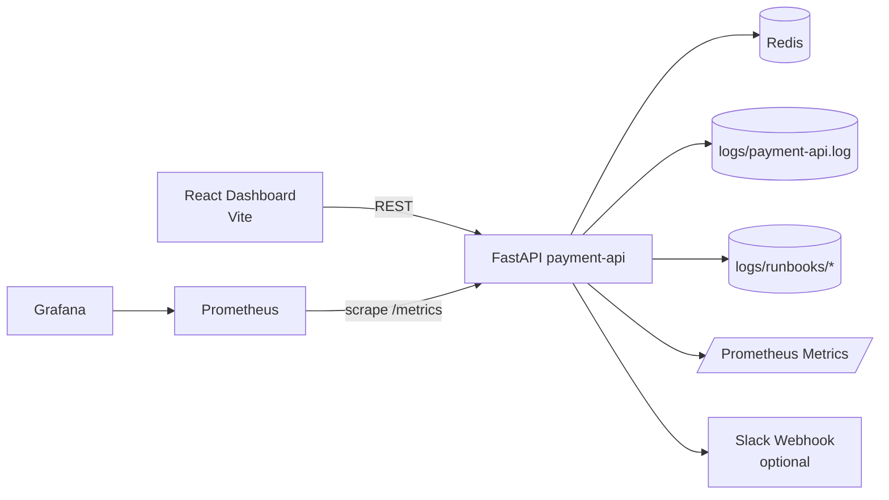

# AI Incident Commander

Production-style fintech incident simulation and response platform for SRE / Platform Engineering portfolios.

AI Incident Commander demonstrates how to detect, triage, automate, and close incidents using observable payment traffic, structured telemetry, and runbook-driven workflows.

## Why This Project Stands Out

- Incident-first engineering design, not just app endpoints
- Realistic fintech payment failure simulation modes
- Metrics + logs + automation in one local stack
- Alert lifecycle in UI: **Active Incidents -> Investigation -> Resolve -> Resolved Incidents**
- Strong interview storytelling for reliability, MTTR reduction, and operational ownership

## Architecture



## Services

- `payment-api` (FastAPI): payment simulation, incident APIs, automation hooks
- `frontend` (React + Vite): command-console style incident UI
- `redis`: local dependency/state backend
- `prometheus`: metrics collection
- `grafana`: operational dashboarding

## Implemented API Surface

| Endpoint | Method | Purpose |
|---|---|---|
| `/pay` | `POST` | Simulates payment processing with success/failure outcomes |
| `/health` | `GET` | Service + dependency health view |
| `/metrics` | `GET` | Prometheus scrape endpoint |
| `/simulate/{mode}` | `POST` | Switches active failure simulation mode |
| `/incident/summary` | `GET` | Returns generated incident summary context |
| `/dashboard/data` | `GET` | Dashboard-focused aggregated incident data |
| `/alerts/webhook` | `POST` | Alert intake for automation/runbook pipeline |
| `/drill/chaos` | `POST` | Multi-stage chaos drill runner |
| `/notifications/slack/test` | `POST` | Test Slack notification path |
| `/notifications/slack/incident` | `POST` | Incident notification path |

## Failure Simulation Modes

- `normal`
- `latency_spike`
- `db_pool_exhausted`
- `timeout_storm`
- `error_spike`

## Observability Signals

### Structured Logs
`logs/payment-api.log` includes consistent JSON fields for incident analysis, including:
- timestamp
- service
- level
- transaction_id
- endpoint
- customer_id
- error_type
- message
- latency_ms
- incident_mode

### Prometheus Metrics
- total requests
- failed requests
- payment latency histogram
- DB pool exhausted counter
- timeout counter

## Dashboard UX Flow

1. Open with **Alerts** view
2. Toggle incident list between:
   - **Active Incidents**
   - **Resolved Incidents**
3. Click any alert to open:
   - selected alert context
   - incident summary panel
   - logs/traces panel (toggle)
4. Use automation controls:
   - send Slack notification
   - run alert automation
   - resolve workflow with editable actions
   - runbook panel toggle

## Project Structure

```text
ai-incident-commander/
├── app/
│   ├── api/routes.py
│   ├── services/
│   ├── config.py
│   ├── logging_config.py
│   ├── main.py
│   └── metrics.py
├── frontend/
│   ├── src/App.jsx
│   ├── src/styles.css
│   └── ...
├── grafana/
│   ├── dashboards/
│   └── provisioning/
├── prometheus/prometheus.yml
├── scripts/traffic_generator.py
├── logs/
├── docker-compose.yml
├── Dockerfile
├── Makefile
├── .env.example
└── README.md
```

## Quick Start

```bash
cp .env.example .env
make up
make ps
```

Open:
- Frontend: `http://localhost:5173`
- API docs: `http://localhost:8000/docs`
- Prometheus: `http://localhost:9090`
- Grafana: `http://localhost:3000`

Grafana defaults:
- username: `admin`
- password: `admin`

Prometheus:
- no auth configured in local dev

## Interview Demo Script (5-10 min)

1. Show healthy state:
```bash
make normal
make health
```
2. Inject incident + traffic:
```bash
make timeout
make load
```
3. In UI, show:
- active critical/high alerts
- selected alert details + summary + logs
4. Trigger automation actions
5. Mark incident resolved with notes/actions
6. Switch to **Resolved Incidents** and show runbook updates

## Useful Commands

- `make up` / `make down` / `make restart`
- `make ps`
- `make health`
- `make metrics`
- `make summary`
- `make normal | latency | timeout | dbexhaust | error`
- `make load`
- `make alert-webhook`
- `make runbook`

## Troubleshooting

- Frontend not updating: restart frontend container or run `make restart`
- No alerts showing: switch simulation mode from `normal` to `timeout` or `error` and run load
- Prometheus empty: confirm `payment-api` is healthy and `/metrics` responds
- Grafana login issue: verify `.env` values for `GRAFANA_ADMIN_USER` and `GRAFANA_ADMIN_PASSWORD`

## Production Reliability Relevance

This repo maps directly to real SRE responsibilities:
- detecting customer-impacting degradation quickly
- correlating error, latency, and dependency stress
- standardizing remediation actions and documentation
- tracking incident lifecycle from active to resolved

## Resume Bullets

- Built a local incident command platform (FastAPI, React, Prometheus, Grafana, Redis) to simulate fintech payment failures and demonstrate end-to-end incident handling.
- Implemented alert-driven runbook automation with resolved-incident lifecycle tracking and structured telemetry to showcase practical MTTR-reduction workflows.
